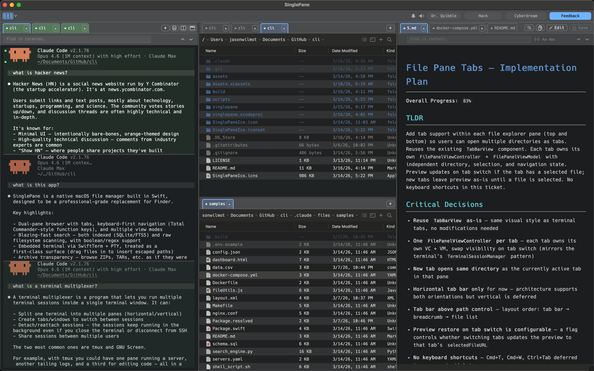
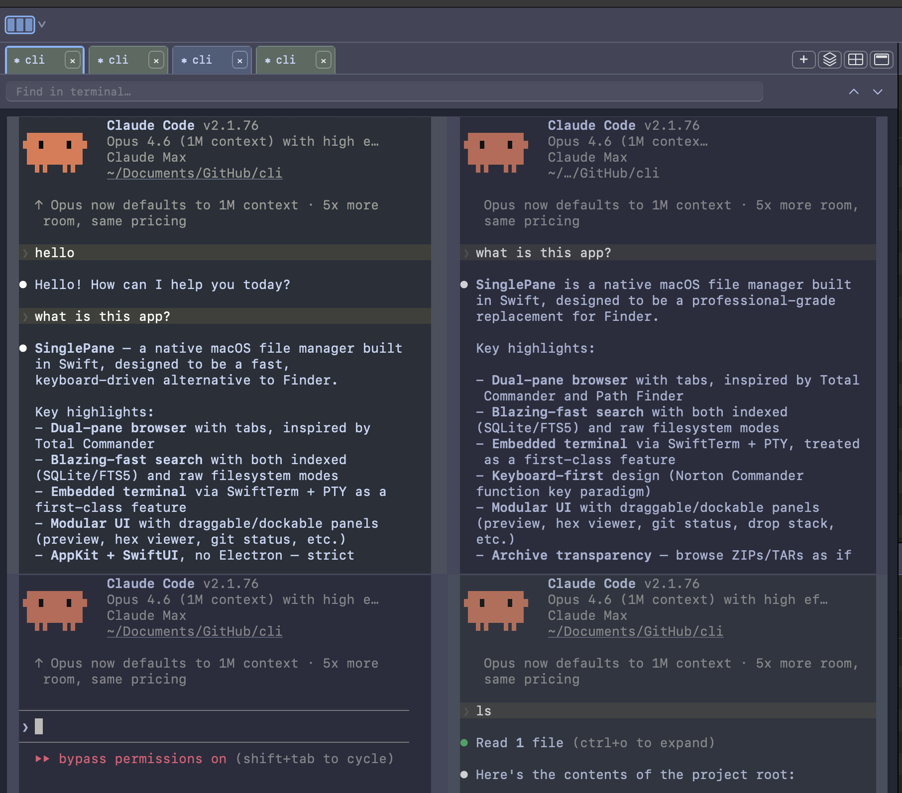
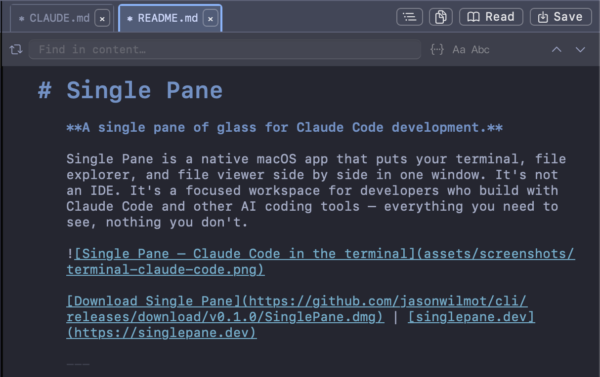
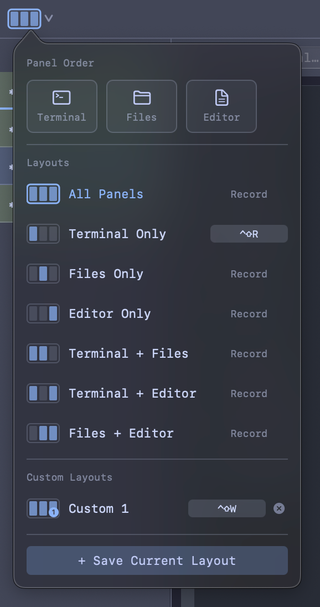
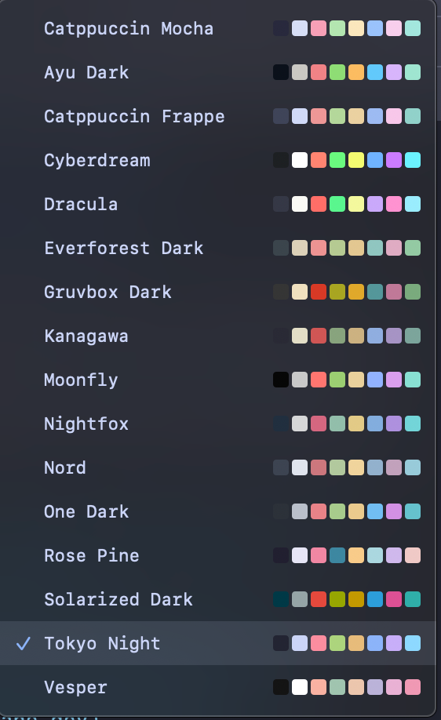

# Single Pane

**A single pane of glass for Claude Code development.**

Single Pane is a native macOS app that puts your terminal, file explorer, and file viewer side by side in one window. It's not an IDE. It's a focused workspace for developers who build with Claude Code and other AI coding tools — everything you need to see, nothing you don't.

[Download Single Pane](https://github.com/jasonwilmot/cli/releases/download/v0.1.0/SinglePane.dmg) | [singlepane.dev](https://singlepane.dev)

---

## Terminal

A full terminal built into your workspace. Run Claude Code, manage processes, and work across multiple sessions without switching apps.

**Tabbed sessions** — Open as many terminal tabs as you need. Each session runs independently with its own shell.

**Split panes and grid view** — Run sessions side by side in splits, or switch to grid view to see all your sessions at once. Perfect for monitoring multiple Claude Code instances in parallel.

**Drag files to insert paths** — Drag any file or folder from the explorer directly into the terminal. Single Pane inserts the properly escaped path at your cursor — no more typing long paths or dealing with spaces and special characters.

**Clickable links and paths** — URLs, file paths, and references in terminal output are automatically detected. Click to open them. Paths with line numbers (like `file.swift:42`) are recognized too.

**Hints mode** — Press `Cmd+Shift+E` to highlight every URL, file path, and reference visible in the terminal. Type the hint label to open it, or hold `Shift` to copy it to your clipboard.

**Find in terminal** — Press `Cmd+F` to search through terminal output. Navigate between matches with `Enter` and `Shift+Enter`.

**Command status at a glance** — The gutter shows success and failure indicators for each command, so you can scan your history and spot errors instantly.

### Claude Code Audio Hooks

Single Pane plays audio cues when Claude Code events happen in your terminal sessions, so you know what's going on without watching the screen. Each event triggers a distinct sound:

| Event | When it plays |
|-------|---------------|
| **Start** | A Claude Code session begins or resumes |
| **Prompt** | You submit a prompt, before Claude starts processing |
| **Agent** | Claude spawns a subagent to handle a task |
| **Stop** | Claude finishes responding |
| **End** | A session terminates |
| **Notification** | Claude needs your input (permission prompts, etc.) |

Single Pane connects to Claude Code through its [hooks system](https://docs.anthropic.com/en/docs/claude-code/hooks). When you enable audio in Single Pane, it registers hooks for `SessionStart`, `UserPromptSubmit`, `SubagentStart`, `Stop`, `SessionEnd`, and `Notification` events in your Claude Code settings. Each hook sends a lightweight URL scheme call back to Single Pane, which plays the appropriate sound.

Choose from 9 voice packs and 3 sound packs, or mute individual events. You also get macOS notifications for **Stop** and **Notification** events, so you'll see a banner when Claude finishes a task or needs your attention — even if the app is in the background.

**Preview the sounds:**

🔔 [▶ Notification sound](https://github.com/jasonwilmot/singlepane/raw/main/assets/audio/notification-sample.mp4) · 🤖 [▶ Subagent sound](https://github.com/jasonwilmot/singlepane/raw/main/assets/audio/subagent-sample.mp4)

---

## File Explorer

A dual-pane file browser with tabs, built for navigating projects quickly.

**Dual panes with unlimited tabs** — The familiar dual-pane interface simplifies managing multiple folders and directories, making it easy to transfer files between them efficiently. Open your source in one pane and your destination in the other, then copy or move files with a single keystroke. Each pane supports as many tabs as you need, so you can keep multiple directories accessible without losing your place.

**List and thumbnail views** — Switch between a detailed list view (name, size, date, kind) and a thumbnail grid. Thumbnail sizes are adjustable across three tiers.

**Smart breadcrumb navigation** — The breadcrumb bar does more than show your path. Click any segment to see sibling directories in a dropdown. Click the empty space to type a path directly with autocomplete. Previously visited deeper paths appear as faded "ghost" segments you can click to jump back.

**Filter as you type** — Start typing in any directory to instantly filter the file list. A filter pill shows your active filter with a clear button.

**Full-text search** — Search across filenames and file contents from the breadcrumb bar. Toggle between filename and content search, enable regex matching, and switch case sensitivity. Results stream in as they're found.

**Live updates** — When files change on disk, the explorer updates automatically. No manual refresh needed.

**Keyboard-driven file operations** — Use classic function key shortcuts for common operations:

| Key | Action |
|-----|--------|
| `Enter` | Open file or navigate into folder |
| `F5` | Copy |
| `F6` | Move |
| `F7` | New folder |
| `F8` | Delete |
| `Backspace` | Delete |
| `Cmd+V` | Paste |

---

## Reader / Editor

Preview and edit files without leaving Single Pane. Markdown, code, images, PDFs, audio, and video — all handled natively.

**Markdown preview and editing** — Markdown files open in a rendered preview. Click "Edit" to switch to a live editor with auto-continuing lists, heading markers in the margin, and paragraph-aware formatting. Click "Read" to switch back to the preview.

**Heading outline** — A collapsible outline panel shows all headings in the current markdown file. Click any heading to jump to it. The outline highlights your current position as you scroll.

**Syntax highlighting** — Code files are displayed with syntax highlighting for Swift, JavaScript, TypeScript, Python, Ruby, Rust, Go, C, C++, SQL, Shell, JSON, YAML, TOML, XML, and more. Colors follow your active theme.

**Large file handling** — Open files of any size. For large files, Single Pane loads only the visible portion of the file, keeping the app responsive regardless of file size.

**Media preview** — View images inline. Play audio and video with native playback controls. Render PDFs directly in the preview pane.

**Find and replace** — Press `Cmd+F` in the editor or code preview to search. Supports case-sensitive and regex matching. Replace individual matches or all at once.

**Bracket matching** — Matching brackets, parentheses, and braces are highlighted as you navigate code. HTML and XML tag pairs are matched too.

**Status bar** — The bottom of the editor shows file encoding, line endings (LF/CRLF), indentation style (spaces/tabs), and your current line and column position.

---

## Layouts and Customization

Arrange your workspace the way you work.

**Three-column layout** — Terminal, file explorer, and reader sit side by side in a split view. Drag the dividers to resize each panel to your liking.

**Snap layouts** — Choose from preset arrangements with a single click. Full-width terminal, equal thirds, explorer-focused — pick the layout that fits your task.

**Custom layouts** — Save your own panel arrangements. Name them, assign keyboard shortcuts, and switch between them instantly.

**Panel reordering** — Rearrange the order of your panels. Put the terminal on the left, the explorer in the middle, the reader on the right — or any other combination.

**16 bundled themes** — Switch between Dracula, Nord, Tokyo Night, Rose Pine, Gruvbox, Solarized, Catppuccin, Everforest, Nightfox, Kanagawa, Ayu, Cyberdream, Vesper, Moonfly, and more. Themes apply consistently across the terminal, editor, file explorer, and all UI elements.

**Font selection** — Choose your preferred monospace font. The selection applies across the terminal and editor. Single Pane ships with 10 bundled fonts:

- Hack
- Inconsolata
- Fira Code
- JetBrains Mono
- Victor Mono
- Cascadia Code
- Departure Mono
- Maple Mono
- Iosevka
- Geist Mono

System fonts like SF Mono, Menlo, Monaco, and Courier New are also available. All fonts include Nerd Font symbol support for Powerline glyphs and developer icons.

---

## Keyboard Shortcuts

Single Pane is designed to be used entirely from the keyboard. Every major action has a shortcut.

### Global

| Shortcut | Action |
|----------|--------|
| `Ctrl+Tab` | Cycle focus to the next panel |
| `Ctrl+Shift+Tab` | Cycle focus to the previous panel |
| `Cmd+F` | Open find bar in the focused panel |
| `Cmd+N` | New terminal tab |
| `Cmd+Control+F` | Toggle full screen |

### Terminal

| Shortcut | Action |
|----------|--------|
| `Cmd+Shift+E` | Activate hints mode |
| `Cmd+Up` | Jump to previous command |
| `Cmd+Down` | Jump to next command |

### File Explorer

| Shortcut | Action |
|----------|--------|
| `Enter` | Open file or enter folder |
| `Backspace` | Delete selected item |
| `F5` | Copy |
| `F6` | Move |
| `F7` | New folder |
| `F8` | Delete |
| `Cmd+V` | Paste |
| *Start typing* | Filter files in the current directory |

### Find Bar (Terminal, Editor, Preview)

| Shortcut | Action |
|----------|--------|
| `Enter` | Next match |
| `Shift+Enter` | Previous match |
| `Escape` | Close find bar |

### Layouts

Assign custom keyboard shortcuts to any layout — snap presets or your own saved layouts — through the layout manager.

---

## Download

Single Pane requires **macOS 14 Sonoma** or later.

[Download Single Pane (.dmg)](https://github.com/jasonwilmot/cli/releases/download/v0.1.0/SinglePane.dmg)

---

## License

Single Pane is free and open source under the [MIT License](LICENSE).

---

[singlepane.dev](https://singlepane.dev)
